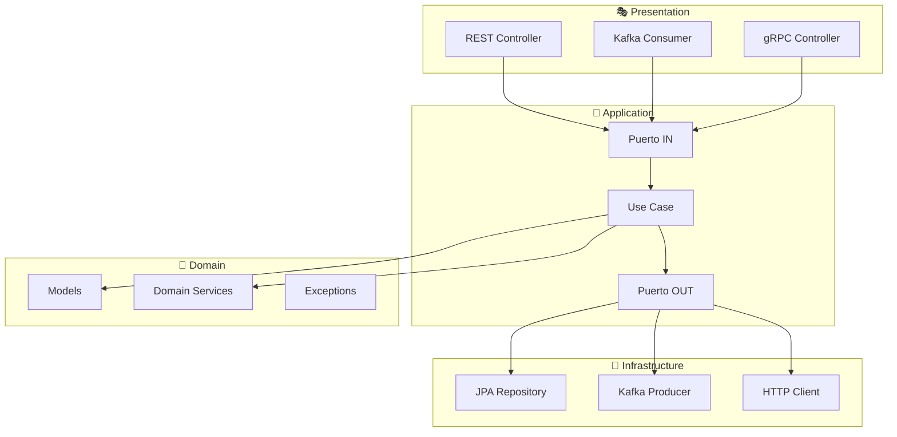
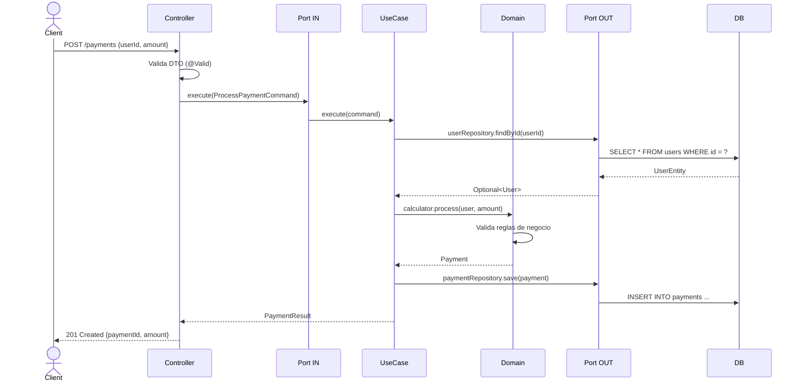
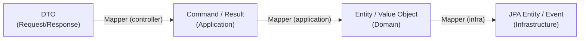
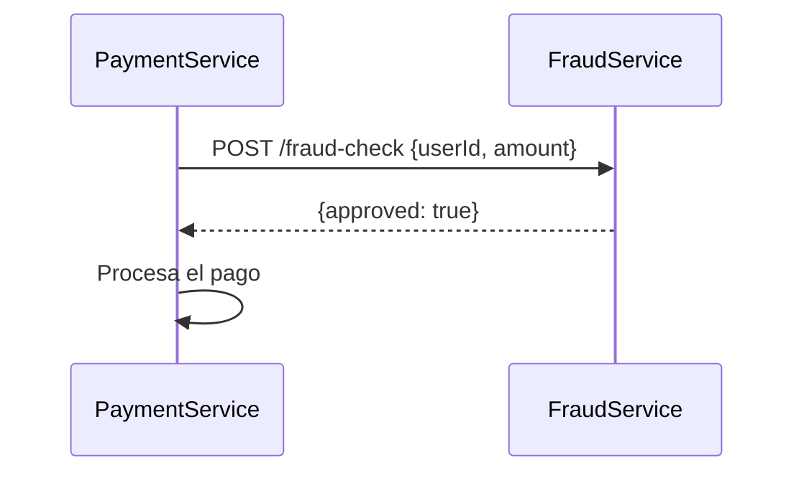
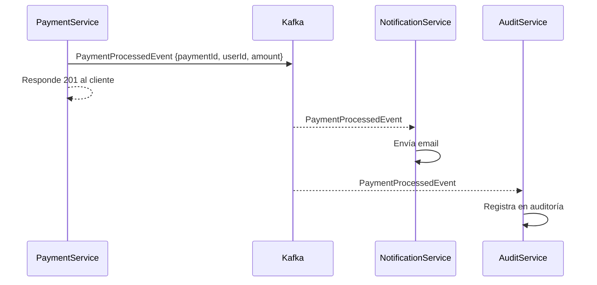
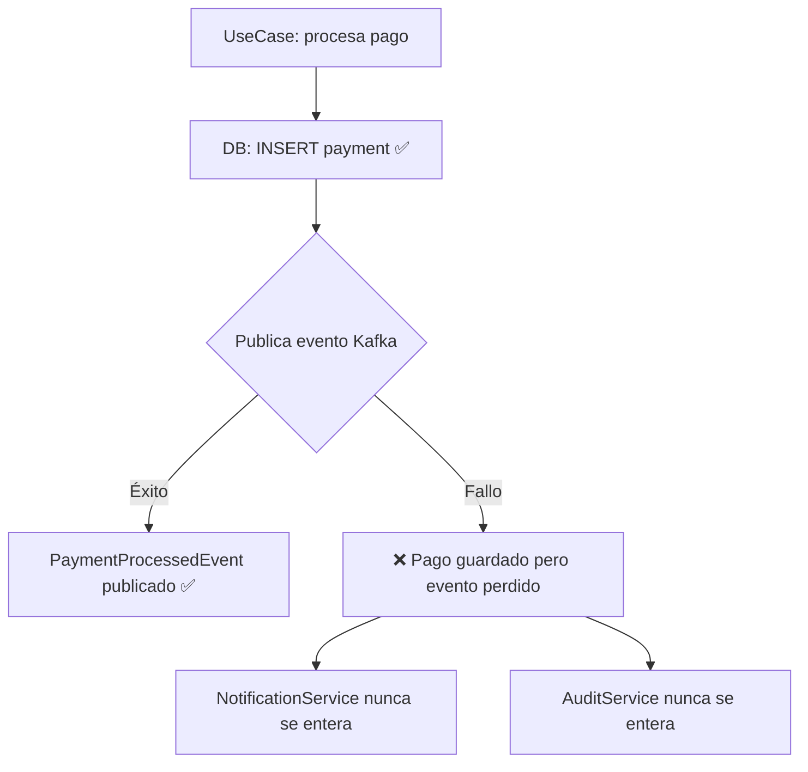
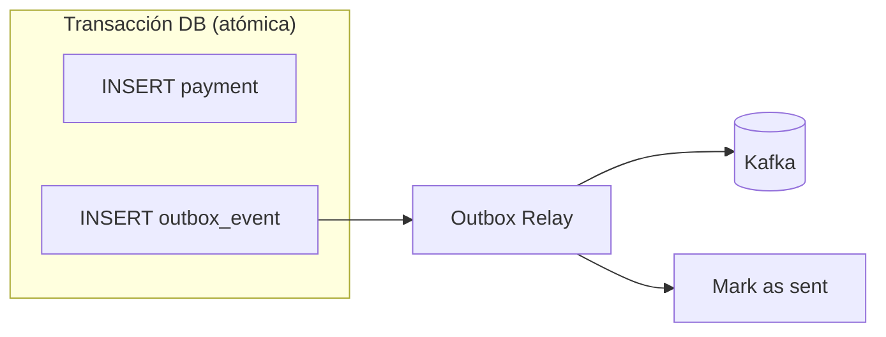
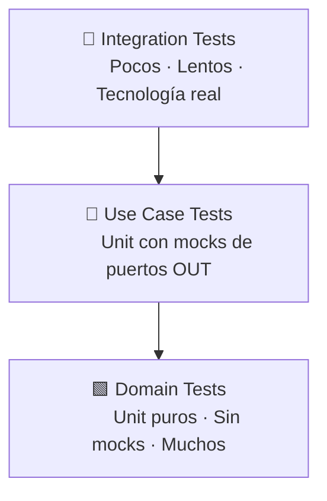
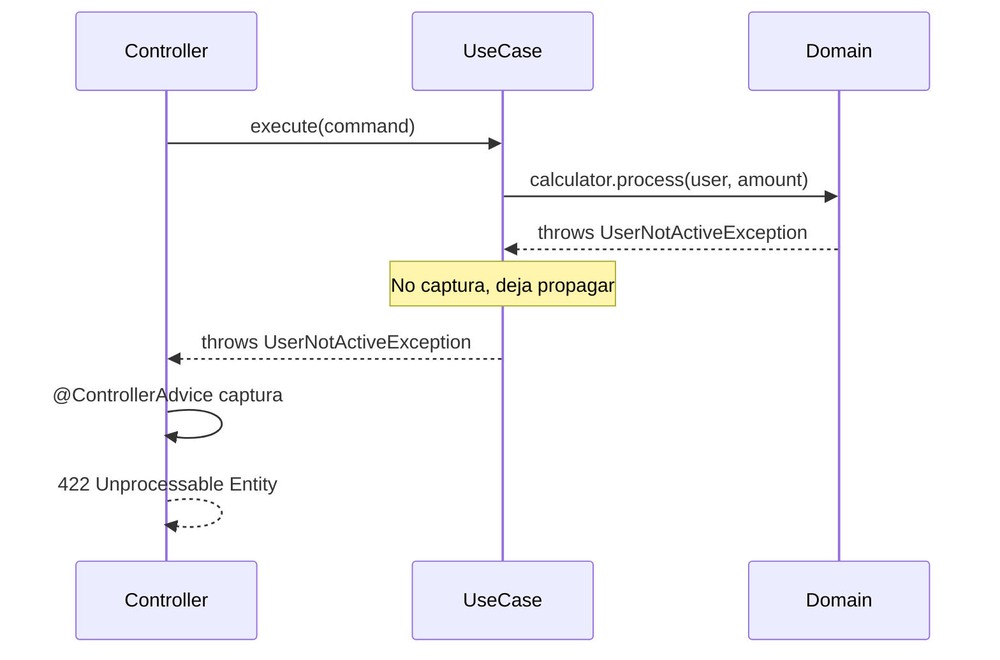

# Diseño de Microservicios Escalables

Guía académica para construir microservicios mantenibles, fiables y preparados para crecer,
basada en arquitectura hexagonal (Ports & Adapters), Domain-Driven Design y los principios
de sistemas de datos intensivos descritos por Martin Kleppmann en
*Designing Data-Intensive Applications*.

---

## Índice

1. [Las tres propiedades fundamentales](#1-las-tres-propiedades-fundamentales)
2. [Arquitectura hexagonal por capas](#2-arquitectura-hexagonal-por-capas)
3. [Flujo de una petición](#3-flujo-de-una-petición)
4. [Modelos por capa](#4-modelos-por-capa)
5. [Estructura de carpetas](#5-estructura-de-carpetas)
6. [Comunicación entre servicios](#6-comunicación-entre-servicios)
7. [Consistencia y fiabilidad](#7-consistencia-y-fiabilidad)
8. [Estrategia de tests](#8-estrategia-de-tests)
9. [Gestión de errores](#9-gestión-de-errores)
10. [Reglas de oro](#10-reglas-de-oro)

---

## 1. Las tres propiedades fundamentales

Kleppmann abre su libro definiendo qué significa que un sistema funcione correctamente.
Todo lo demás en esta guía es consecuencia de estas tres propiedades.

### Fiabilidad (*Reliability*)
> El sistema debe funcionar correctamente incluso cuando las cosas van mal.

Un microservicio fiable tolera fallos de hardware, errores de software y errores humanos
sin perder datos ni dejar el sistema en un estado inconsistente. En la práctica:

- Las reglas de negocio no dependen del estado de una red o una base de datos.
- Las operaciones críticas son **idempotentes**, osea que ejecutarlas dos veces produce el mismo resultado que una.
- Los errores se comunican de forma explícita, nunca silenciosa.

### Escalabilidad (*Scalability*)
> El sistema debe tener formas razonables de manejar el crecimiento.

Escalar no significa solo añadir máquinas. Significa haber tomado decisiones de diseño
que no impidan crecer. En la práctica:

- El dominio de negocio está desacoplado de la tecnología de persistencia o mensajería
- Los servicios pueden desplegarse y escalarse de forma independiente
- El modelo de datos no crea cuellos de botella artificiales

### Mantenibilidad (*Maintainability*)
> El sistema debe poder ser operado, entendido y modificado por personas distintas a quien lo construyó.

Kleppmann lo desglosa en tres sub-propiedades: operabilidad (fácil de operar), simplicidad
(fácil de entender) y extensibilidad (fácil de cambiar). En la práctica:

- Cada componente tiene una única responsabilidad clara
- Los contratos entre capas están definidos por interfaces, no por implementaciones
- El código nuevo no requiere entender todo el sistema para escribirse

---

## 2. Arquitectura hexagonal por capas

La arquitectura hexagonal (Alistair Cockburn, 2005) resuelve el problema de mantenibilidad
describiendo un sistema como un núcleo de negocio rodeado de adaptadores intercambiables.

> **El dominio no depende de nadie. Todos dependen del dominio.**



La dirección de dependencias siempre apunta **hacia adentro**.
Infraestructura depende de Application. Application depende de Domain.
Domain no depende de nadie.

### 🎭 Presentation / Controller
**Responsabilidad única:** traducir el mundo exterior al lenguaje de la aplicación.

- Recibe peticiones (HTTP, eventos Kafka, llamadas gRPC)
- Valida formato y tipos de entrada (`@Valid`, `@NotNull`...)
- Mapea DTOs entrantes a `Command` y `Result` a DTO de salida
- Captura excepciones de dominio y las traduce a respuestas HTTP (`@ControllerAdvice`)
- **No contiene lógica de negocio**

### 🧠 Application (casos de uso)
**Responsabilidad único:** orquestar el flujo de negocio.

- Implementa los puertos IN (interfaces que llama el controller)
- Obtiene entidades del dominio a través de puertos OUT
- Delega decisiones de negocio al dominio
- Gestiona transacciones (`@Transactional`)
- Emite eventos si procede
- **No contiene reglas de negocio**, solo las coordina

### 🧱 Domain
**Responsabilidad única:** representar y proteger el negocio.

- Modelos con invariantes autoprotegidas: el constructor valida, el objeto nunca queda en estado inválido
- Value Objects inmutables
- Servicios de dominio para lógica que no pertenece a un solo modelo
- Excepciones de negocio propias
- **Sin dependencias externas.** Sin Spring, sin JPA, sin nada.

### 🔌 Infrastructure
**Responsabilidad única:** implementar los puertos OUT con tecnología concreta.

- Repositorios JPA, clientes HTTP, productores Kafka
- Mappers entre modelos de dominio y entidades técnicas (JPA Entity, Avro, Protobuf...)
- Configuración técnica (DataSource, Kafka, OpenFeign...)
- **No contiene lógica de negocio**

---

## 3. Flujo de una petición



---

## 4. Modelos por capa

Cada capa tiene sus propios modelos. **Nunca se pasa un modelo de dominio al controller,
ni una entidad JPA al dominio.**



| Capa           | Modelo                 | Responsable del mapeo     |
|----------------|------------------------|---------------------------|
| Controller     | DTO (Request/Response) | `PaymentDtoMapper`        |
| Application    | Command, Result        | `PaymentMapper`           |
| Domain         | Entity, Value Object   | — (el dominio los crea)   |
| Infrastructure | JPA Entity, Evento     | `PaymentEntityMapper`     |

### Por qué importa

Si el controller devuelve directamente el modelo de dominio:
- Se expone el modelo interno como contrato público de la API
- Un cambio de negocio rompe el contrato de la API sin quererlo
- Es imposible devolver proyecciones distintas del mismo dato

---

## 5. Estructura de carpetas

```
src/main/java/com/example/payment/
│
├── controller/
│   ├── rest/
│   │   ├── PaymentController.java
│   │   ├── dto/
│   │   │   ├── ProcessPaymentRequest.java
│   │   │   └── ProcessPaymentResponse.java
│   │   └── mapper/
│   │       └── PaymentDtoMapper.java
│   ├── kafka/
│   │   ├── PaymentEventConsumer.java
│   │   └── event/
│   └── advice/
│       └── GlobalExceptionHandler.java       ← @ControllerAdvice aquí
│
├── application/
│   ├── usecase/
│   │   └── ProcessPaymentUseCase.java        ← implementa ProcessPaymentPort
│   ├── port/
│   │   ├── in/
│   │   │   └── ProcessPaymentPort.java       ← interfaz que llama el controller
│   │   └── out/
│   │       ├── PaymentRepository.java        ← interfaz que implementa infra
│   │       └── UserRepository.java
│   ├── command/
│   │   └── ProcessPaymentCommand.java
│   ├── result/
│   │   └── PaymentResult.java
│   └── mapper/
│       └── PaymentMapper.java                ← Domain ↔ Command/Result
│
├── domain/
│   ├── model/
│   │   ├── Payment.java
│   │   └── User.java
│   ├── service/
│   │   └── PaymentCalculator.java
│   └── exception/
│       ├── UserNotFoundException.java
│       ├── UserNotActiveException.java
│       └── PaymentLimitExceededException.java
│
└── infrastructure/
    ├── persistence/
    │   ├── jpa/
    │   │   ├── JpaPaymentRepository.java     ← implementa PaymentRepository
    │   │   └── JpaUserRepository.java        ← implementa UserRepository
    │   ├── entity/
    │   │   ├── PaymentEntity.java
    │   │   └── UserEntity.java
    │   └── mapper/
    │       └── PaymentEntityMapper.java
    ├── messaging/
    │   └── producer/
    │       ├── PaymentEventProducer.java
    │       └── event/
    │           └── PaymentProcessedEvent.java
    ├── client/
    │   └── FraudCheckClient.java
    └── config/
        ├── JpaConfig.java
        └── KafkaConfig.java
```

---

## 6. Comunicación entre servicios

Kleppmann dedica varios capítulos a cómo los sistemas se comunican entre sí y las implicaciones
de cada elección. Esta decisión es una de las más importantes en el diseño de microservicios.

### Comunicación síncrona (REST / gRPC)

El servicio que llama espera la respuesta antes de continuar.



**Ventajas:** simple de implementar, respuesta inmediata, fácil de razonar.

**Riesgos:**
- **Acoplamiento temporal:** si `FraudService` está caído, `PaymentService` también falla
- **Latencia acumulada:** en cadenas largas (A llama a B que llama a C...) la latencia se suma
- **Disponibilidad degradada:** la disponibilidad del sistema es el producto de la disponibilidad de cada servicio

> Si A tiene 99.9% de uptime y B tiene 99.9%, la operación que requiere ambos tiene ~99.8%.
> Con diez servicios en cadena: ~99%.

### Comunicación asíncrona (Kafka / mensajería)

El servicio publica un evento y continúa sin esperar respuesta.



**Ventajas:**
- Desacoplamiento temporal: el productor no necesita que los consumidores estén disponibles
- Escalabilidad: los consumidores escalan de forma independiente
- Extensibilidad: añadir un nuevo consumidor no requiere cambiar el productor

**Riesgos:**
- El flujo es más difícil de seguir y depurar
- La consistencia es eventual, no inmediata
- Los mensajes pueden llegar duplicados o fuera de orden

### Cuándo usar cada uno

| Criterio                          | Síncrono (REST/gRPC)      | Asíncrono (Kafka)             |
|-----------------------------------|---------------------------|-------------------------------|
| Necesito respuesta inmediata      | ✅                        | ❌                            |
| El consumidor puede fallar        | ❌ (me afecta)            | ✅ (reintenta solo)           |
| Múltiples consumidores            | ❌ (fan-out costoso)      | ✅ (natural)                  |
| Orden garantizado                 | ✅                        | ⚠️ (solo por partición)      |
| Trazabilidad simple               | ✅                        | ❌ (requiere correlationId)   |

---

## 7. Consistencia y fiabilidad

Este es el capítulo donde Kleppmann es más valioso y más ignorado en la práctica.

### El problema de la consistencia distribuida

En un sistema distribuido, no existe una operación atómica que afecte a dos sistemas distintos.
Si un pago se guarda en base de datos y luego se publica un evento en Kafka, esas son dos
operaciones separadas. Cualquiera puede fallar independientemente de la otra.



### Solución: Outbox Pattern

En lugar de publicar el evento directamente a Kafka, se escribe en una tabla `outbox`
dentro de la misma transacción que el pago. Un proceso separado lee esa tabla y publica
a Kafka. La escritura en base de datos y la intención de publicar son atómicas.



### Idempotencia

Kleppmann lo plantea como principio de diseño: **diseña tus operaciones para que ejecutarlas
dos veces sea equivalente a ejecutarlas una vez**.

En sistemas distribuidos, los reintentos son inevitables (timeouts, fallos de red, reinicios).
Si una operación no es idempotente, los reintentos producen efectos duplicados: pagos dobles,
notificaciones repetidas, registros de auditoría incorrectos.

```java
// ❌ No idempotente: cada llamada crea un pago nuevo
public Payment processPayment(ProcessPaymentCommand command) {
    return new Payment(command.userId(), command.amount());
}

// ✅ Idempotente: si ya existe un pago con ese idempotencyKey, lo devuelve
public Payment processPayment(ProcessPaymentCommand command) {
    return paymentRepository
        .findByIdempotencyKey(command.idempotencyKey())
        .orElseGet(() -> createAndSave(command));
}
```

La clave de idempotencia la genera el cliente y la envía en cada petición.
El servidor la usa para detectar duplicados sin necesitar coordinación externa.

### Consistencia eventual

En sistemas con mensajería asíncrona, los datos no son consistentes en todos los servicios
en el mismo instante. Esto es normal y esperado. El diseño debe aceptarlo:

- No asumir que lo que se acaba de escribir ya está disponible en otro servicio
- Diseñar la UI para tolerar datos que pueden estar ligeramente desactualizados
- Usar `correlationId` para rastrear un flujo a través de múltiples servicios y logs

---

## 8. Estrategia de tests

> Testea comportamiento, no implementación. Cada capa se testea aislada.



| Capa              | Tipo de test     | Mocks                          | Objetivo                                      |
|-------------------|------------------|--------------------------------|-----------------------------------------------|
| Domain model      | Unit puro        | Ninguno                        | Invariantes: estado inválido imposible        |
| Domain service    | Unit puro        | Ninguno                        | Reglas de negocio complejas                   |
| Use Case          | Unit con mocks   | Puertos OUT (repos, servicios) | Flujo de orquestación y casos de error        |
| Controller        | `@WebMvcTest`    | Puerto IN (use case)           | Serialización, validación HTTP, códigos error |
| Infrastructure    | Integration test | Ninguno (tecnología real)      | Queries reales, transacciones, Kafka real     |

### Lo que se testea por capa

**Domain:** Un `Payment` no puede crearse con importe negativo.
Un `User` inactivo lanza `UserNotActiveException`. Un límite de `0` es válido.

**Use Case:** Si el usuario no existe, se lanza `UserNotFoundException` y no se llama a
`paymentRepository.save()`. Si el pago se procesa correctamente, se guarda y se devuelve
el resultado mapeado.

**Controller:** `POST /payments` con body inválido devuelve `400`.
`UserNotFoundException` devuelve `404`. `PaymentLimitExceededException` devuelve `422`.

**Infrastructure:** El repositorio JPA persiste y recupera correctamente un `Payment`.
El mapper entre `PaymentEntity` y `Payment` es correcto en ambas direcciones.

### Lo que NO se debe hacer

- ❌ Mockear el dominio en tests de use case — usa instancias reales de `PaymentCalculator`
- ❌ `@SpringBootTest` para testear un use case — es lento e innecesario
- ❌ Testear métodos privados o getters triviales
- ❌ Un test de integración que cubre todo como sustituto de tests unitarios
- ❌ Assertions sobre estado interno — testea el comportamiento observable

---

## 9. Gestión de errores

Las excepciones de dominio son el mecanismo de comunicación entre el dominio y el exterior.
El mapeo a HTTP es responsabilidad exclusiva de la capa de presentación.



```java
// controller/advice/GlobalExceptionHandler.java
@RestControllerAdvice
public class GlobalExceptionHandler {

    @ExceptionHandler(UserNotFoundException.class)
    @ResponseStatus(HttpStatus.NOT_FOUND)
    public ErrorResponse handleUserNotFound(UserNotFoundException ex) {
        return new ErrorResponse(ex.getMessage());
    }

    @ExceptionHandler(UserNotActiveException.class)
    @ResponseStatus(HttpStatus.UNPROCESSABLE_ENTITY)
    public ErrorResponse handleUserNotActive(UserNotActiveException ex) {
        return new ErrorResponse(ex.getMessage());
    }

    @ExceptionHandler(PaymentLimitExceededException.class)
    @ResponseStatus(HttpStatus.UNPROCESSABLE_ENTITY)
    public ErrorResponse handleLimitExceeded(PaymentLimitExceededException ex) {
        return new ErrorResponse(ex.getMessage());
    }
}
```

**Reglas:**
- Las excepciones de dominio extienden `RuntimeException`, nunca llevan anotaciones de Spring
- El use case nunca captura excepciones de dominio, las deja propagar
- El controller nunca tiene `try/catch` para lógica de negocio
- Cada excepción de dominio representa un concepto de negocio, no un error técnico

---

## 10. Reglas de oro

Estas reglas son las que más duelen cuando se rompen en proyectos grandes:

1. **El dominio no importa nada de Spring.** Si ves `@Service` o `@Component` en `domain/`, algo falla.

2. **Los puertos IN son siempre interfaces.** `ProcessPaymentUseCase` implementa `ProcessPaymentPort`.
   El controller depende de la interfaz, nunca de la implementación concreta.

3. **Los modelos de dominio no salen de la capa de aplicación.** El controller nunca recibe
   ni devuelve un `Payment` o `User` del dominio.

4. **Las entidades JPA nunca entran al dominio.** `PaymentEntity` ≠ `Payment`.
   El mapper de infraestructura hace la conversión en ambas direcciones.

5. **El ID lo asigna la infraestructura, no el dominio.** `UUID.randomUUID()` en el constructor
   de un modelo de dominio acopla el dominio a una decisión técnica. La base de datos o el
   repositorio deben asignar el identificador al persistir.

6. **Una excepción de dominio = un concepto de negocio.** No lances `RuntimeException` genéricas
   desde el dominio. Cada excepción debe tener nombre y significado propio.

7. **`Optional` en los puertos OUT, nunca `null`.** `UserRepository.findById()` devuelve
   `Optional<User>`. Devolver `null` transfiere la responsabilidad del error al llamador.

8. **Diseña para el fallo, no contra él.** Las redes fallan, los servicios se caen, los mensajes
   se duplican. Las operaciones críticas deben ser idempotentes y el sistema debe recuperarse
   solo ante fallos transitorios.

9. **La consistencia eventual es un contrato, no un bug.** Si usas mensajería asíncrona, acepta
   que distintos servicios verán el estado en momentos distintos y diseña en consecuencia.

10. **El acoplamiento temporal es deuda técnica.** Cada llamada síncrona entre servicios es una
    dependencia de disponibilidad. Si puedes modelarlo como evento, hazlo.