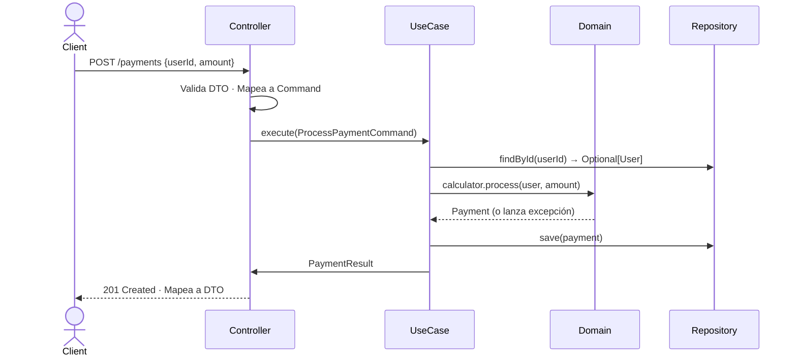
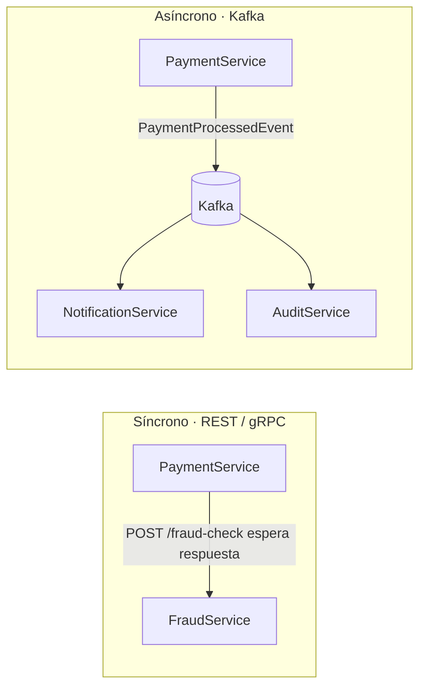
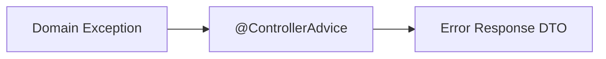
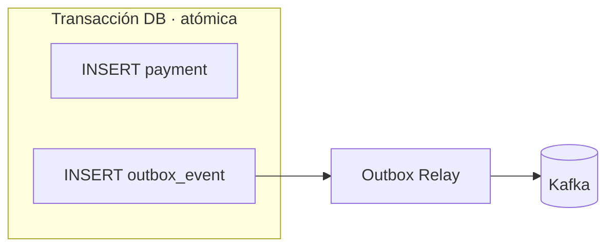
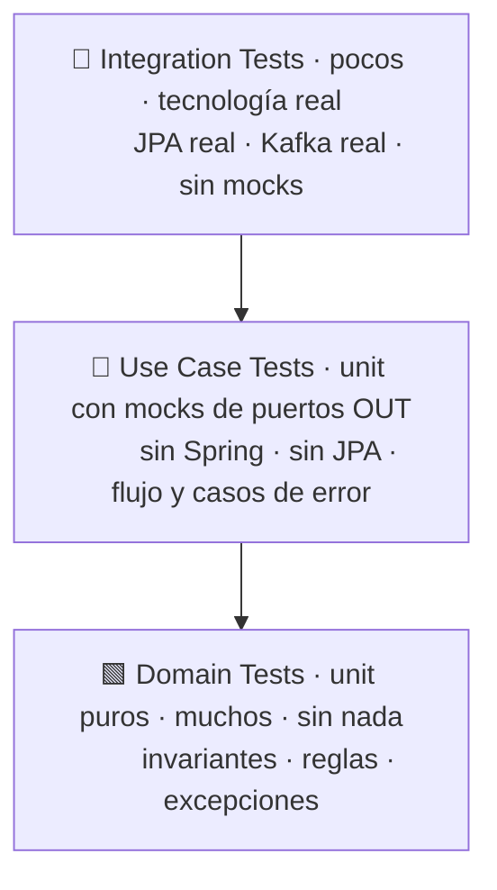

# Diseño de Microservicios Escalables

Guía de referencia basada en arquitectura hexagonal, DDD y los principios de
*Designing Data-Intensive Applications* (Martin Kleppmann).

---

## Arquitectura

Todo el diseño se resume en este diagrama. Cada capa tiene una responsabilidad única,
sus propios objetos y sus propios mappers. **Las dependencias siempre apuntan hacia adentro.**

```mermaid
flowchart TD
    subgraph PRES["🎭 Presentation"]
        direction LR
        DTO["   
            DTO
            Request / Response
        "]
        DtoMapper["Mapper"]
        DTO --> DtoMapper
    end

    subgraph APP["🧠 Application"]
        direction LR
        CMD["Command / Result"]
        UC["
            Use Case
            implementa Puerto IN
        "]
        AppMapper["Mapper"]
        CMD --> UC
        UC --> AppMapper
    end

    subgraph DOMAIN["🧱 Domain"]
        direction LR
        MODEL["Entity / Value Object"]
        DS["Domain Service"]
        EXC["Exception"]
        MODEL --> DS
    end

    subgraph INFRA["🔌 Infrastructure"]
        direction LR
        InfraMapper["Mapper"]
        ENTITY["
            JPA Entity
            Kafka Event
        "]
        DB[("DB / Kafka")]
        InfraMapper --> ENTITY --> DB
    end

    DtoMapper -->|Command| CMD
    AppMapper -->|Domain Model| MODEL
    DS -->|Domain Model| AppMapper
    AppMapper -->|Domain Model| InfraMapper

    style DOMAIN fill:#1a1a2e,stroke:#4a4a8a
```



### Responsabilidades por capa

| Capa           | Hace                                              | No hace                        |
|----------------|---------------------------------------------------|--------------------------------|
| Presentation   | Valida entrada, traduce DTO ↔ Command/Result      | Lógica de negocio              |
| Application    | Orquesta el flujo, mapea entre capas adyacentes   | Reglas de negocio              |
| Domain         | Protege invariantes, toma decisiones de negocio   | Depender de Spring, JPA, Kafka |
| Infrastructure | Implementa puertos OUT con tecnología concreta    | Lógica de negocio              |

---

## Flujo de una petición



El use case es el **único punto de entrada al negocio**, independientemente de si llega
por REST, Kafka o gRPC. Cada adaptador de entrada mapea a `Command` antes de llamarlo.

```
REST Controller  → mapper propio → Command ─┐
Kafka Consumer   → mapper propio → Command ─┤─▶ ProcessPaymentUseCase
gRPC Controller  → mapper propio → Command ─┘
```

---

## Comunicación entre servicios



| Criterio                     | Síncrono              | Asíncrono                    |
|------------------------------|-----------------------|------------------------------|
| Respuesta inmediata          | ✅                    | ❌                           |
| Fallo del consumidor         | ❌ me afecta          | ✅ reintenta solo            |
| Múltiples consumidores       | ❌ fan-out costoso    | ✅ natural                   |
| Disponibilidad compuesta     | ❌ se multiplica      | ✅ desacoplada               |
| Trazabilidad                 | ✅ simple             | ⚠️ requiere correlationId   |

> Con diez servicios síncronos encadenados al 99.9% de uptime cada uno: **~99% de disponibilidad total.**

---

## Manejo de excepciones



Las excepciones de dominio se lanzan desde el dominio y se capturan en un único punto de la capa de presentación. El use case **no las atrapa**: las deja propagarse.

```java
@RestControllerAdvice
public class GlobalExceptionHandler {

    @ExceptionHandler(UserNotFoundException.class)
    public ResponseEntity<ErrorResponse> handle(UserNotFoundException ex) {
        return ResponseEntity.status(404).body(new ErrorResponse(ex.getMessage()));
    }
}
```

| Excepción                       | HTTP | Capa que la lanza |
|---------------------------------|------|-------------------|
| `UserNotFoundException`         | 404  | Domain            |
| `UserNotActiveException`        | 422  | Domain            |
| `PaymentLimitExceededException` | 422  | Domain            |
| `IllegalArgumentException`      | 400  | Domain            |

**Regla:** una excepción por invariante. El dominio lanza, la presentación traduce. Nunca al revés.

---

## Consistencia y fiabilidad (Kleppmann)

### Doble write: el problema

Guardar en DB y publicar en Kafka son dos operaciones. Si Kafka falla después de la escritura
en DB, el evento se pierde y los consumidores nunca se enteran.

### Outbox Pattern: la solución



### Idempotencia

Las operaciones críticas deben poder ejecutarse dos veces sin efectos duplicados.
El cliente genera una `idempotencyKey` y el servidor la usa para detectar reintentos.

```java
// ✅ Idempotente
return paymentRepository
    .findByIdempotencyKey(command.idempotencyKey())
    .orElseGet(() -> createAndSave(command));
```

---

## Tests



| Capa           | Herramienta       | Mockea                   |
|----------------|-------------------|--------------------------|
| Domain         | JUnit puro        | Nada                     |
| Use Case       | JUnit + Mockito   | Puertos OUT              |
| Controller     | `@WebMvcTest`     | Puerto IN                |
| Infrastructure | `@SpringBootTest` | Nada (tecnología real)   |

**No hacer:** mockear el dominio en tests de use case · `@SpringBootTest` para un use case · un test de integración como sustituto de unitarios.

---

## Reglas de oro

1. **El dominio no depende de nadie.** Sin `@Service`, sin JPA, sin Spring en `domain/`.
2. **Los puertos IN son interfaces.** El controller depende de `ProcessPaymentPort`, no de `ProcessPaymentUseCase`.
3. **Cada capa tiene sus objetos.** `DTO` ≠ `Command` ≠ `Entity` ≠ `Domain Model`.
4. **Los mappers entre capas viven en Application**, excepto DTO↔Command que vive en cada adaptador de entrada.
5. **El ID lo asigna la infraestructura**, no el constructor del modelo de dominio.
6. **`Optional` en los puertos OUT, nunca `null`.**
7. **Diseña para el fallo.** Las operaciones críticas son idempotentes. Los reintentos son inevitables.
8. **La consistencia eventual es un contrato**, no un bug. Úsala conscientemente.
9. **El acoplamiento temporal es deuda técnica.** Si puedes modelarlo como evento, hazlo.